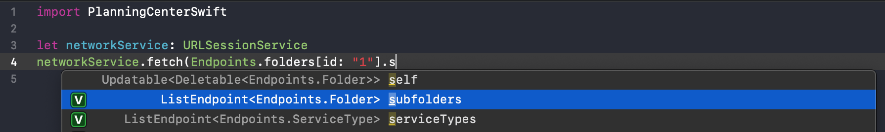

# PlanningCenterSwift

Planning Center Swift is a library to make interaction with Planning Center's [developer API](https://developer.planning.center/docs/#/introduction) easy. It supports Xcode code completion by using generics and protocols to offer strong static typing of the endpoints and responses by Planning Center's API.



## Goals
### Code Completion
Routes and model properties should be discoverable using code completion in Xcode.
### Synthesized Support of `Swift.Codable`
Models and Endpoints should not need to write custom conformance to Codable.

## Supported Platforms
This project was developed alongside an iOS App, [Services Scheduler](), so it has been tested most throughly on that platform. The goals for the project do include being usable on Linux for server-side development.

## Installation

### Swift Package Manager Dependency
    .package(url: "https://github.com/javb99/PlanningCenterSwift.git", .branch("master"))

### Source Code via Command Line
    git clone git@github.com:javb99/PlanningCenterSwift.git
    open ./PlanningCenterSwift/Package.swift
    
## Dependencies
This project is only dependent on [SwiftJSONAPI](https://github.com/javb99/SwiftJSONAPI). It is just the generic part of the model code that could potentially be resused for other APIs that conform to the [JSON:API 1.0 Specification](https://jsonapi.org). Both packages are maintained side by side.

## Examples
Use the `Endpoints` namespace to access the endpoints.

### Endpoint to path conversions
| Path | Equivalent Key Path | Description |
| ----- | ----------------------- | -------------- |
| `service_types` | `Endpoints.serviceTypes` | The first page of `ServiceType`s |
| `service_types/1` | `Endpoints.serviceTypes[id: "1"]` | The `ServiceType` with id 1 |
|`service_types/1` | `Endpoints.serviceTypes[id: "1"].plans.filter(.future)` | The future plans for the service type with id 1 |

### Usage

```swift
import PlanningCenterSwift
```

Create a `URLSessionService` to execute API requests.
```swift
let network = URLSessionService(authenticationProvider: BasicAuthenticationProvider(id: "<<Service ID>>", password: "<<Service Secret>>"))
```

Service Type names could be printed as follows:
```swift
network.fetch(Endpoints.serviceTypes) { result in
    switch result {
    case let .success(_, _, document):
        print("Received service type names: \(document.data!.map{$0.name})")
    case let .failure(error):
        print("Failed: \(error)")
    }
}
```

## Contributing
...

## External Links
- [Planning Center Developer Documentation](https://developer.planning.center)
- [JSON:API 1.0 Specification](https://jsonapi.org)
- [JSON:API Swift (The basis of this framework)](https://github.com/javb99/SwiftJSONAPI)


## Copyright
Joseph Van Boxtel, 2019
